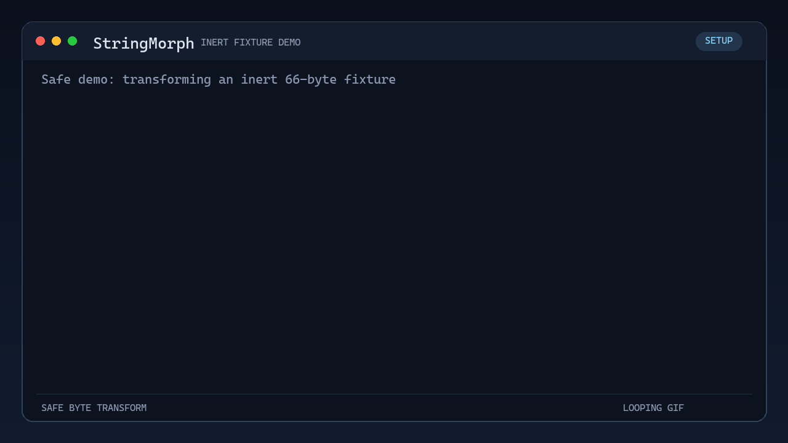

# StringMorph

**StringMorph** extracts printable ASCII strings and their byte offsets from binary files and can replace selected strings in a separate copy. It runs with Python 3 and the standard library.

## Demo



The animation is generated from real CLI runs against a harmless 66-byte fixture. It shows extraction, a write-free preview, modification, and an independent check that the output has the same length and no bytes outside the selected range changed. Regenerate it with `python tools/create_demo_gif.py` after installing Pillow.

### What preservation means

StringMorph validates byte ranges and preserves file length and all bytes outside the selected ranges. **These checks do not guarantee that a modified executable still works.** Import names, filenames, lookup keys, format strings, and other program data can be essential even when a replacement has exactly the same length. Random replacement is irreversible; it does not encrypt strings or restore their original values at runtime. Executable signatures and application integrity checks may also be invalidated.

Use a reviewed CSV containing only strings whose contents are known to be dispensable. Validate the modified program with its own functional tests. Adding more scrambling algorithms does not resolve this limitation for existing compiled binaries. For example, Windows import names must match the names exported by the corresponding DLL ([Microsoft PE specification](https://learn.microsoft.com/en-us/windows/win32/debug/pe-format#hintname-table)).

## Features

- **ASCII String Extraction**: Extracts ASCII strings from a binary file, allowing you to filter by length and keywords.
- **Binary Modification**: Modify binary files based on extracted strings or an external CSV file, with options for custom character substitutions.
- **SHA256 Hashing**: Generates and displays SHA256 hashes for both the original and modified binary files.
- **Flexible Options**: Includes testing mode, verbose output, and options to use specific characters for string scrambling.

## Installation

Clone the repository and navigate to the project directory:

```bash
git clone https://github.com/jperezduerto/StringMorph.git
cd StringMorph
```

Ensure you have Python 3 installed. You can run the program directly without any additional dependencies.

## Usage

### Command-Line Options

- `filename`: The binary file to inspect and/or modify.
- `-l, --length`: Minimum length of ASCII strings to consider (default: 7).
- `-k, --keywords`: Comma-separated, case-insensitive keywords. For compatibility, supplying keywords uses the shortest keyword length instead of `--length`. Empty keyword elements are rejected.
- `-v, --verbose`: Print output to the terminal.
- `-o, --output`: Specify a new output CSV file name (default: `output.csv`). Existing files are never overwritten.
- `--no-space`: Consider strings separated by spaces as individual strings.
- `-e, --execute`: Modify the binary file using extracted strings or sourcefile.
- `-t, --test`: Validate and display replacements without creating or changing any files, including CSV and temporary files. Cannot be combined with `--execute`.
- `--single-char`: Replace letters with exactly one printable ASCII character; digits become `4` and punctuation is preserved. Without this option, letters and digits are randomized within their respective classes.
- `-s, --sourcefile`: Specify a CSV file to use for binary modifications instead of extracting strings.

### Basic String Extraction

Extract ASCII strings from a binary file and save them to a CSV file:

```bash
python StringMorph.py binaryfile.bin -o output.csv
```

### Extract Strings with Keyword Filtering

Extract strings that contain specific keywords:

```bash
python StringMorph.py binaryfile.bin -k keyword1,keyword2 -o output.csv
```

### Binary Modification Based on Extracted Strings

Extract strings afresh and modify a separate copy of the binary. Both output paths must be new; this command does not reuse a previously edited CSV:

```bash
python StringMorph.py binaryfile.bin -e -o fresh-strings.csv
```

### Modify Binary File Using an External CSV File

Modify a binary file using an external CSV file (`sourcefile.csv`), which contains the positions and strings to be replaced:

```bash
python StringMorph.py binaryfile.bin -s sourcefile.csv -e
```

### Test Mode

Run the binary modification in test mode (no file will be saved, and modifications will be displayed):

```bash
python StringMorph.py binaryfile.bin -t
```

### Use a Single Character for String Replacement

Replace letters with `A` and digits with `4`, preserving punctuation and spaces:

```bash
python StringMorph.py binaryfile.bin -s sourcefile.csv -e --single-char A
```

### Example Commands

1. **Extract strings of at least 7 characters** from `sample.bin`:
   ```bash
   python StringMorph.py sample.bin -l 7 -o strings.csv
   ```

2. **Modify `sample.bin` using strings from `source.csv`** with the default random string replacements:
   ```bash
   python StringMorph.py sample.bin -s source.csv -e
   ```

3. **Preview modifications** with letters replaced by `X` and digits by `4`:
   ```bash
   python StringMorph.py sample.bin -s source.csv -t --single-char X
   ```

4. **Extract strings containing specific keywords** and modify the binary file:
   ```bash
   python StringMorph.py sample.bin -k label,description -e
   ```

5. **Treat spaces as separators** and save to a new `strings.csv`:
   ```bash
   python StringMorph.py sample.bin --no-space -o strings.csv
   ```

6. **Generate SHA256 hashes** of the original and modified binary files:
   ```bash
   python StringMorph.py sample.bin -e -o strings.csv
   ```

### Additional Information

The tool reports SHA-256 hashes of the input snapshot and the modified bytes. Hashes identify the data; they do not prove functional equivalence. The original file is preserved, and the modified copy is named `<stem>_modified<extension>`.

### CSV contract and output handling

CSV files use UTF-8 (an optional UTF-8 BOM is accepted), with exactly two columns and the header `Location,String`. Locations are nonnegative hexadecimal offsets, optionally prefixed with `0x`. Strings must be nonempty printable ASCII and must exactly match the input bytes at their offsets.

Duplicate offsets, overlapping ranges, out-of-bounds ranges, malformed rows, and stale strings reject the entire plan before writing outputs. Adjacent ranges and a header-only CSV are valid; a header-only plan makes an unchanged copy.

Every replacement must have the same byte length as its original. Output files are staged in their destination directories and published without overwriting existing paths. This requires a filesystem with hard-link support, such as NTFS or ext4; unsupported filesystems fail without overwriting files. After a write/publication failure, cleanup attempts to remove every temporary file and every output published by that operation. Any cleanup failures report the paths that may remain, while retaining the original error. If publication succeeds but temporary-file cleanup fails, output is still reported as saved and the remaining temporary paths are reported separately. Publication of a binary and CSV together is not a crash-atomic transaction.

### Tests

Run the synthetic-data regression suite without third-party dependencies:

```bash
python -m unittest discover -s tests -v
```

These tests verify extraction, validation, preview behavior, and byte preservation. They do not execute input binaries or establish application compatibility.

## Contributions

Contributions are welcome! Feel free to submit issues or pull requests to enhance the tool.
